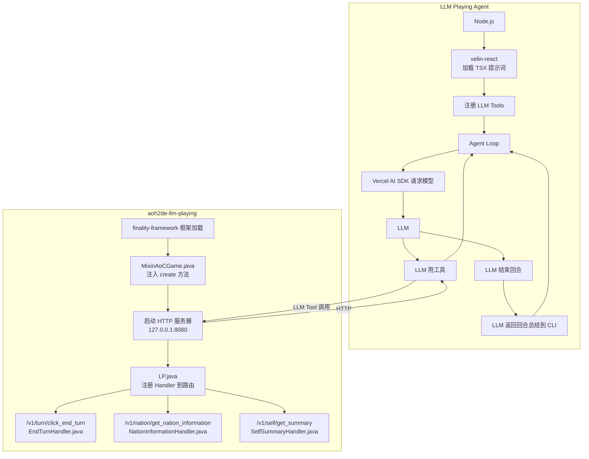

# LLM Playing

让 LLM 游玩《历史时代 2：DE》（Age of History II: Definitive Edition）。（服务端）

QQ 群：[597524393](https://qm.qq.com/q/nC2N5Y1UX0)。

本项目为 Finality Framework 插件，依赖于 [Finality Loader](https://github.com/Finality-Framework/loader) 启动。

如果你需要 Agent，可以使用 [LLM Playing Agent](https://github.com/TASA-Ed/aoh2de-llm-playing-agent)。



## 功能

- 游戏启动后自动启动本地 HTTP 服务，供 LLM Agent、脚本或其他工具调用。
- 提供国家、地区、军队、外交、建筑和回合等事件查询与操作。
- 所有游戏读写都切换到游戏主线程执行，避免直接从 HTTP 工作线程访问游戏状态。

## 需求

- [《Age of History II: Definitive Edition》](https://store.steampowered.com/app/3381680/Age_of_History_2_Definitive_Edition/)
- [Finality Loader](https://github.com/Finality-Framework/loader) 1.6.0+
- Java 8

## 使用

在创意工坊中订阅 [LLM Playing](https://steamcommunity.com/sharedfiles/filedetails/?id=3785324635)，随后使用 [Finality Loader](https://github.com/Finality-Framework/loader) 启动游戏。

插件将在游戏创建时启动服务器，目前会优先使用 `8080`，若端口被占用，则依次尝试至 `8089`。最终的监听地址会输出到 Finality Loader 日志（或终端中，如果你使用命令行启动 Loader），如：

```text
[I] LLM Playing HTTP server started at http://127.0.0.1:8080
```

如果全部 10 个端口都被占用，服务器将不会启动。请尝试释放其中一个端口后重启游戏。

启动 [LLM Playing Agent](https://github.com/TASA-Ed/aoh2de-llm-playing-agent)（可选）。

大功告成！

## 构建

1. 将游戏 JAR 放到 `libs/game.jar`。
2. 将 Finality Loader JAR 放到 `libs/`。本仓库已经提供，你也可以自行选择替换最新版本（如有）。
3. 在项目根目录执行：

```powershell
.\gradlew release
```

## 使用 API

参考 [openapi.yaml](./openapi.yaml)。

### 通用约定

- 健康检查 `GET /v1/health` 返回纯文本 `OK`，即使游戏尚未可操作也可用于确认服务已启动。
- 除健康检查外，所有接口均为 `POST`，使用 UTF-8 JSON 请求和响应。
- 空请求体等同于 `{}`，需要参数的接口仍会验证必填字段。
- 请求体最大为 64 KiB。
- 成功响应为 `{"success":true}` 或 `{"success":true,"result":{...}}`，失败响应为 `{"success":false,"error":{"code":"...","message":"..."}}`。
- HTTP `409` 表示当前游戏状态不允许该操作，例如不在可下达命令的回合阶段，`503` 表示游戏尚未准备完成。
- 建议不要并发提交多个操作。

## 开发

```powershell
# 编译与打包
.\gradlew.bat build

# 生成用于发布的 shadow JAR 与源码 JAR
.\gradlew.bat release

# 格式化 Java 源码
.\gradlew.bat spotlessApply

# 校验 OpenAPI 文档（需要可用的 pnpx / npm 环境）
.\gradlew.bat lintOpenApi
```

提交接口变更时应同时更新 `openapi.yaml`，确保工具定义与实际实现一致。

## 许可证

本项目采用 [AGPL 3.0](./LICENSE) 许可证。
