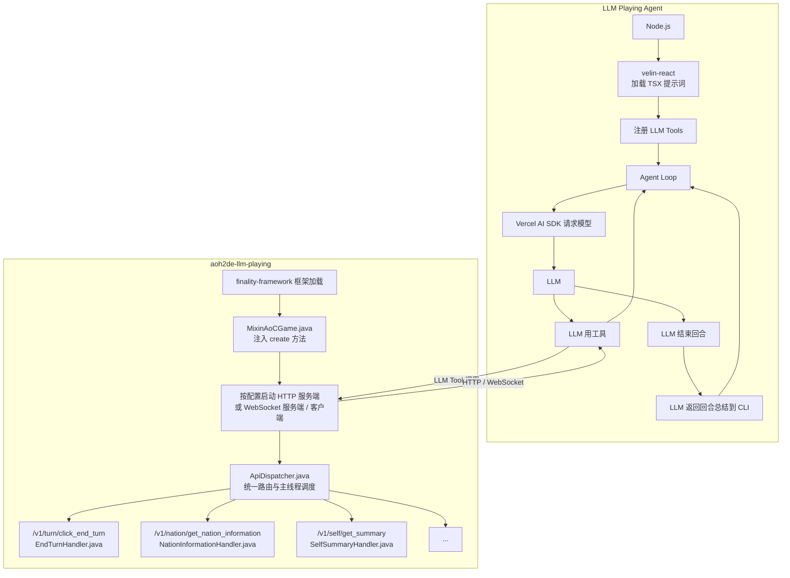

# LLM Playing

让 LLM 游玩《历史时代 2：DE》（Age of History II: Definitive Edition）。支持 HTTP 服务端、WebSocket 服务端和 WebSocket 客户端三种运行模式。

QQ 群：[597524393](https://qm.qq.com/q/nC2N5Y1UX0)。

本项目为 Finality Framework 插件，依赖于 [Finality Loader](https://github.com/Finality-Framework/loader) 启动。

如果你需要 Agent，可以使用 [LLM Playing Agent](https://github.com/TASA-Ed/aoh2de-llm-playing-agent)。


```mermaid
flowchart TB

    subgraph A["LLM Playing Agent"]
        A1["Node.js"]
        A4["velin-react<br/>加载 TSX 提示词"]
        A5["注册 LLM Tools"]
        A6["Agent Loop"]
        A7["Vercel AI SDK 请求模型"]
        A8["LLM"]
        A9["LLM 用工具"]
        A10["LLM 结束回合"]
        A11["LLM 返回回合总结到 CLI"]

        A1 --> A4 --> A5 --> A6
        A6 --> A7 --> A8
        A8 --> A9 --> A6
        A8 --> A10 --> A11 --> A6
    end

    subgraph B["aoh2de-llm-playing"]
        B1["finality-framework 框架加载"]
        B3["MixinAoCGame.java<br/>注入 create 方法"]
        B4["按配置启动 HTTP 服务端<br/>或 WebSocket 服务端 / 客户端"]
        B5["ApiDispatcher.java<br/>统一路由与主线程调度"]

        B6["/v1/turn/click_end_turn<br/>EndTurnHandler.java"]
        B7["/v1/nation/get_nation_information<br/>NationInformationHandler.java"]
        B8["/v1/self/get_summary<br/>SelfSummaryHandler.java"]
        B9["..."]

        B1 --> B3 --> B4 --> B5
        B5 --> B6
        B5 --> B7
        B5 --> B8
        B5 --> B9
    end

    A9 -->|"LLM Tool 调用"| B4
    B4 -->|"HTTP / WebSocket"| A9
```

## 功能

- 游戏启动后按配置启动一种传输模式，供 LLM Agent、脚本或其他工具调用；HTTP / WS 服务端使用 Javalin，WS 客户端使用 `java.net.http.WebSocket`。
- 提供国家、地区、军队、外交、建筑和回合等事件查询与操作。
- 三种模式复用相同的路由与业务处理；所有游戏读写都切换到游戏主线程执行，避免直接从网络线程访问游戏状态。
- 配置读取及 HTTP / WebSocket JSON 编解码使用 Jackson 3；业务处理器使用原生 `ObjectNode` / `ArrayNode`。

## 需求

- [《Age of History II: Definitive Edition》](https://store.steampowered.com/app/3381680/Age_of_History_2_Definitive_Edition/)
- [Finality Loader](https://github.com/Finality-Framework/loader) 1.6.0+
- Java 17 或更高版本

## 使用

在创意工坊中订阅 [LLM Playing](https://steamcommunity.com/sharedfiles/filedetails/?id=3785324635)，随后使用 [Finality Loader](https://github.com/Finality-Framework/loader) 启动游戏。

在游戏根目录创建 `LP_Config.json`（注意文件名大小写），通过 `mode` 选择运行模式。配置在游戏启动时读取，修改后需重启游戏；一次只运行一种模式。

### HTTP 服务端（默认）

```json
{
  "mode": "http-server",
  "host": "127.0.0.1",
  "port": 8080
}
```

使用 Javalin 监听 `http://127.0.0.1:8080`，保留原有 `/v1` HTTP API。没有配置文件，或旧配置只有 `host` / `port` 时，默认使用此模式。

```sh
curl http://127.0.0.1:8080/v1/health
curl -X POST http://127.0.0.1:8080/v1/self/get_summary -H "Content-Type: application/json" -d '{}'
```

### WebSocket 服务端

```json
{
  "mode": "ws-server",
  "host": "127.0.0.1",
  "port": 8080,
  "wsPath": "/ws"
}
```

使用 Javalin 监听 `ws://127.0.0.1:8080/ws`。Agent 主动连接插件，通过下文的 JSON 消息协议调用接口；此模式不提供 HTTP 游戏接口，包括 HTTP 健康检查。

### WebSocket 客户端

```json
{
  "mode": "ws-client",
  "wsUrl": "ws://127.0.0.1:9000/ws"
}
```

插件使用 `java.net.http.WebSocket` 主动连接 `wsUrl` 指定的远端服务（支持 `ws://` 和 `wss://`），不监听本地端口。远端服务发送操作请求，插件执行后沿同一连接返回结果；不是将本地 HTTP 请求转发到远端。

远端服务应先于游戏启动。连接超时为 10 秒；连接失败或断开后不会自动重连，也不会重试游戏操作。恢复远端服务后需重启游戏建立连接。

### 配置字段与启动失败

| 字段 | 默认值 | 生效模式 |
| --- | --- | --- |
| `mode` | `http-server` | 全部；仅接受 `http-server`、`ws-server`、`ws-client` |
| `host` | `127.0.0.1` | 两种服务端模式 |
| `port` | `8080` | 两种服务端模式；范围 1–65535 |
| `wsPath` | `/ws` | WS 服务端；绝对路径，不支持通配符、查询参数或片段 |
| `wsUrl` | `ws://127.0.0.1:8080/ws` | WS 客户端；包含主机的完整 URL，不支持用户信息或片段 |

启动模式及地址会输出到 Finality Loader 日志。配置文件存在但为空、格式错误或当前模式字段无效时，不启动任何传输，也不会回退到 HTTP。端口占用或 WS 连接失败同样会记录启动错误。

服务没有内置身份认证。服务端默认只监听本机；如需修改监听地址，请限制为可信网络。WS 客户端只应连接可信服务，因为远端可以控制游戏。

游戏退出时会关闭服务或连接，并取消尚未执行的游戏请求；已经开始执行的操作不会被中断或回滚。

可选用 [LLM Playing Agent](https://github.com/TASA-Ed/aoh2de-llm-playing-agent)；使用 WS 模式时，调用方需支持本文的消息协议。

## 构建

1. 将游戏 JAR 放到 `libs/game.jar`。
2. 将 Finality Loader JAR 放到 `libs/`。本仓库已经提供，你也可以自行选择替换最新版本（如有）。
3. 在项目根目录执行：

```powershell
.\gradlew release
```

## 使用 API

HTTP 接口、路径和业务参数参考 [openapi.yaml](./openapi.yaml)。两种 WS 模式复用同一套路径、方法、参数和业务响应。

### HTTP 通用约定

- 健康检查 `GET /v1/health` 返回纯文本 `OK`，即使游戏尚未可操作也可用于确认服务已启动。
- 除健康检查外，所有接口均为 `POST`，使用 UTF-8 JSON 请求和响应。
- 空请求体等同于 `{}`，需要参数的接口仍会验证必填字段。
- 请求体最大为 64 KiB。
- 成功响应为 `{"success":true}` 或 `{"success":true,"result":{...}}`，失败响应为 `{"success":false,"error":{"code":"...","message":"..."}}`。
- HTTP `409` 表示当前游戏状态不允许该操作，例如不在可下达命令的回合阶段，`503` 表示游戏尚未准备完成。
- 建议不要并发提交多个操作。

### WebSocket 消息协议

WS 服务端与客户端使用相同协议；插件始终是请求的执行方，区别仅在于谁发起连接。每条请求是一个 UTF-8 JSON 文本消息：

```json
{
  "id": "request-1",
  "method": "POST",
  "path": "/v1/self/get_summary",
  "body": {}
}
```

- `id`：必填非空字符串；调用方应保证同一连接内未完成请求的 ID 唯一，用于匹配响应，不用于去重。
- `method`：必填字符串；健康检查为 `GET`，其他接口为 `POST`。
- `path`：必填字符串，精确匹配 OpenAPI 中的路径，不附带查询参数。
- `body`：业务参数对象；省略等同于 `{}`，不能为数组、字符串或 `null`。
- 整条请求消息（包括信封）最大 64 KiB，按 UTF-8 字节计算；支持分片文本消息，不支持二进制消息。

响应信封固定包含 `id`、`status` 和 `body`。例如，游戏尚未准备完成：

```json
{
  "id": "request-1",
  "status": 503,
  "body": {
    "success": false,
    "error": {
      "code": "GAME_NOT_READY",
      "message": "The game application is not ready."
    }
  }
}
```

`status` 对应 HTTP 状态码，`body` 保留原有接口响应对象。成功的游戏操作为 `200`，业务拒绝为 `409`；未知路径为 `404`，方法错误为 `405`，消息 JSON 或信封格式错误为 `400`。无法提取有效 ID 时返回 `"id": null`。

健康检查不依赖游戏状态：

```json
{"id":"health-1","method":"GET","path":"/v1/health"}
```

```json
{"id":"health-1","status":200,"body":"OK"}
```

例如，在支持原生 WebSocket 的 JavaScript 环境中连接 WS 服务端：

```javascript
const socket = new WebSocket('ws://127.0.0.1:8080/ws');
socket.addEventListener('open', () => {
  socket.send(JSON.stringify({ id: 'health-1', method: 'GET', path: '/v1/health' }));
});
socket.addEventListener('message', event => console.log(JSON.parse(event.data)));
```

单个连接按接收顺序处理请求。多个连接仍共享游戏主线程，建议收到响应后再发送下一条游戏操作。连接断开会取消该连接尚未执行的请求，但不能回滚已经执行的操作；未收到响应不代表操作一定未执行，不要盲目重试。

超大消息关闭连接，关闭码为 `1009`；二进制消息关闭码为 `1003`（WS 服务端对超大的二进制消息优先使用 `1009`）。

## 开发

```powershell
# 编译与打包
.\gradlew.bat build

# 生成用于发布的 shadow JAR 与源码 JAR
.\gradlew.bat release

# 格式化 Java 源码
.\gradlew.bat spotlessApply

# 校验 OpenAPI 文档（需要可用的 pnpm / node 环境）
.\gradlew.bat lintOpenApi
```

提交接口变更时应同时更新 `openapi.yaml`，确保工具定义与实际实现一致。

## 许可证

本项目采用 [AGPL 3.0](./LICENSE) 许可证。
